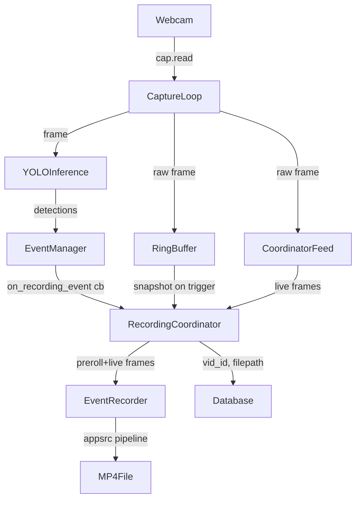

# Event-Triggered Recording with Preroll

## Architecture




## New Files

### `backend/ring_buffer.py`

Thread-safe circular buffer using `collections.deque(maxlen=N)`.

- `RingBuffer(fps, preroll_s)` — computes `maxlen = ceil(fps * preroll_s)`
- `append(frame: np.ndarray)` — stores raw BGR frame with monotonic timestamp
- `snapshot() -> list[tuple[float, np.ndarray]]` — atomic copy of current contents

### `backend/event_recorder.py`

GStreamer `appsrc`-based recorder. Accepts preroll then live frames.

- `EventRecorder(vid_id, output_path, width, height, fps, config_ini_path)`
- Builds pipeline: `appsrc ! videoconvert ! video/x-raw,format=I420 ! textoverlay(x3/clockoverlay) ! x264enc ! h264parse ! qtmux ! filesink`
- `start(preroll_frames)` — pushes preroll buffers with correct PTS, enters live mode
- `push_frame(frame: np.ndarray)` — queues live frame (called from coordinator)
- `stop()` — sends EOS, waits, updates DB with `ended_at` + `duration_s`
- Runs encoding in a dedicated thread; uses `appsrc` in `push` mode

### `backend/recording_coordinator.py`

`vid_id` state machine. Connects EventManager callbacks to EventRecorder lifecycle.

**State per `vid_id`:** `IDLE → RECORDING → COOLDOWN → IDLE`

- `RecordingCoordinator(ring_buffer, config)`
- `on_event(tracking_id, bbox)` — called by EventManager when `event_started`:
  - No active `vid_id` → `uuid4()` new `vid_id`, snapshot ring buffer, create `EventRecorder`, `start()`, write `recordings` row to DB
  - Active `vid_id` within cooldown → link `tracking_id → vid_id` in DB, reset cooldown timer
- `push_frame(frame)` — fan-in from `Tracker._run`; forwards to active `EventRecorder.push_frame` if recording
- Cooldown timer fires in background thread → calls `recorder.stop()`
- Enforces `max_clip_seconds` hard cap via a separate timer

## Modified Files

### `[backend/tracker.py](backend/tracker.py)`

- Instantiate `RingBuffer` inside `Tracker.__init__` (using `config` FPS and preroll)
- Accept optional `recording_coordinator` param in `__init__`
- In `_run` loop, after each `cap.read()`:
  - `ring_buffer.append(frame)` (always, every frame)
  - `recording_coordinator.push_frame(frame)` if coordinator is set and active

### `[backend/event_manager.py](backend/event_manager.py)`

- Add `self.on_recording_event = None` callback in `__init__`
- In `update()`, where `event_started = True` is set (line ~141), call:
  ```python
  if self.on_recording_event:
      self.on_recording_event(obj.tracking_id, obj.bbox)
  ```

### `[backend/config.py](backend/config.py)`

Add to `_SCHEMA`:

```python
"recording_enabled":   ("false", lambda v: ...bool cast...),
"preroll_seconds":     ("3.5",   float),
"cooldown_seconds":    ("5.0",   float),
"max_clip_seconds":    ("300",   int),
"recordings_dir":      ("recordings", str),
```

Add `recordings_dir` as a resolved `Path` property (like `thumbnails_dir`).

### `[backend/database.py](backend/database.py)`

- Add `recordings` table in `init_db()`:
  ```sql
  CREATE TABLE IF NOT EXISTS recordings (
      vid_id     TEXT PRIMARY KEY,
      filepath   TEXT,
      started_at TEXT NOT NULL,
      ended_at   TEXT,
      duration_s REAL,
      preroll_s  REAL DEFAULT 3.5
  );
  ```
- Add `vid_id TEXT REFERENCES recordings(vid_id)` column to `events` (via `ALTER TABLE` migration guard)
- New functions: `create_recording(vid_id, filepath, preroll_s)`, `end_recording(vid_id, ended_at, duration_s)`, `link_event_to_recording(tracking_id, vid_id)`, `get_all_recordings(limit)`

### `[backend/main.py](backend/main.py)`

- Instantiate `RecordingCoordinator` alongside `EventManager` and `Tracker`
- Pass `ring_buffer` (from tracker) to coordinator
- Wire `event_manager.on_recording_event = coordinator.on_event`
- Wire `tracker` to accept `recording_coordinator` param (or set `tracker.recording_coordinator`)
- `mkdir` for `recordings_dir` in lifespan startup
- New endpoint: `GET /api/recordings?limit=50`
- Mount `recordings_dir` as static files at `/recordings`

## Config Extension (`config.ini`)

No structural changes — existing `[overlay]` and `[encoding]` sections in `config.ini` are reused by `EventRecorder`. New recording keys live in `config.py`/`config.json`.

## Key GStreamer Pipeline (`event_recorder.py`)

```
appsrc name=src caps="video/x-raw,format=BGR,width=W,height=H,framerate=FPS/1"
  ! videoconvert
  ! video/x-raw,format=I420
  ! textoverlay name=static_txt text="AC Future" ...
  ! textoverlay name=temp_txt ...
  ! clockoverlay ...
  ! x264enc tune=zerolatency speed-preset=ultrafast bitrate=4000
  ! h264parse ! qtmux
  ! filesink location={vid_id}_{timestamp}.mp4
```

PTS for preroll frames is set from their captured monotonic timestamps relative to the first preroll frame. Live frames continue the PTS sequence.

## Threading Notes

- `RingBuffer.append` and `snapshot` are protected by a `threading.Lock`
- `RecordingCoordinator.push_frame` is non-blocking (drops frame if recorder queue is full)
- `EventRecorder` runs a single internal thread: dequeues frames, pushes GStreamer buffers
- Cooldown and max-clip timers use `threading.Timer`

